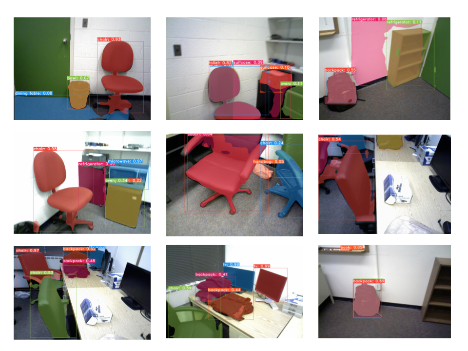
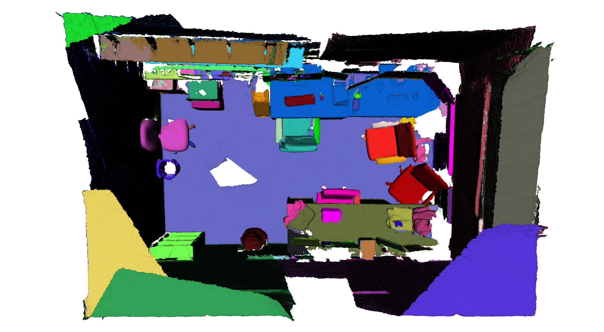
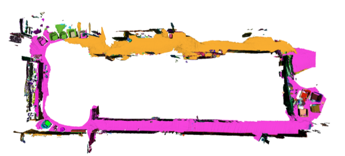

# voxblox-plus-pro
3D Volumertic Semantic Mapping based on [voxblox](https://github.com/ethz-asl/voxblox) and [yolact-ros-pro](https://github.com/DeepDuke/yolact-ros-pro). The repo is modified from [voxblox-plusplus](https://github.com/ethz-asl/voxblox-plusplus)

## Prerequisites
nstall ROS following the instructions at the ROS installation page. The full install (ros-kinetic-desktop-full, ros-melodic-desktop-full) are recommended.

Make sure to source your ROS setup.bash script by following the instructions on the ROS installation page.

## Install
environment: ROS kinetic or ROS melodic

```bash
export ROS_VERSION=kinetic # (Ubuntu 16.04: kinetic, Ubuntu 18.04: melodic)
catkin config --cmake-args -DCMAKE_CXX_STANDARD=14 -DCMAKE_BUILD_TYPE=Release
```
Enter your ros workspace , suppose you workspace is `~/catkin_ws`
```bash
cd ~/catkin_ws/
catkin init
catkin config --extend /opt/ros/$ROS_VERSION --merge-devel 
catkin config --cmake-args -DCMAKE_CXX_STANDARD=14 -DCMAKE_BUILD_TYPE=Release
wstool init src
```

```bash
cd ~/catkin_ws/src
git clone --recurse-submodules https://github.com/ethz-asl/voxblox-plusplus.git
wstool merge -t . voxblox-plusplus/voxblox-plusplus_https.rosinstall
wstool update
```

build rosnodes
```bash
catkin build depth_segmentation gsm_node
source ../devel/setup.bash # (bash shell: ../devel/setup.bash,  zsh shell: ../devel/setup.zsh)
```

## Running
Since this package needs to run with [yolact-ros-pro](https://github.com/DeepDuke/yolact-ros-pro).
We highly recommend to use a ubuntu 16.04 (ROS kinetic) docker container or ubuntu 18.04 (ROS melodic) docker container to build this package.

## Result
Instance semantic segmentation result on dataset  [sceneNN](http://robotics.ethz.ch/~asl-datasets/RAL-2019-voxblox-plusplus/scenenn_231/scenenn_231.bag)

or run this command to download dataset sceneNN

```bash
wget http://robotics.ethz.ch/~asl-datasets/RAL-2019-voxblox-plusplus/scenenn_231/scenenn_231.bag
```



3D mapping result of dataset [sceneNN](http://robotics.ethz.ch/~asl-datasets/RAL-2019-voxblox-plusplus/scenenn_231/scenenn_231.bag)



3D mapping result of dataset [asl_office_floor](http://robotics.ethz.ch/~asl-datasets/RAL-2019-voxblox-plusplus/office_floor/asl_office_floor.bag)

or run this command to download dataset asl_office_floor

```bash
wget http://robotics.ethz.ch/~asl-datasets/RAL-2019-voxblox-plusplus/office_floor/asl_office_floor.bag
```
